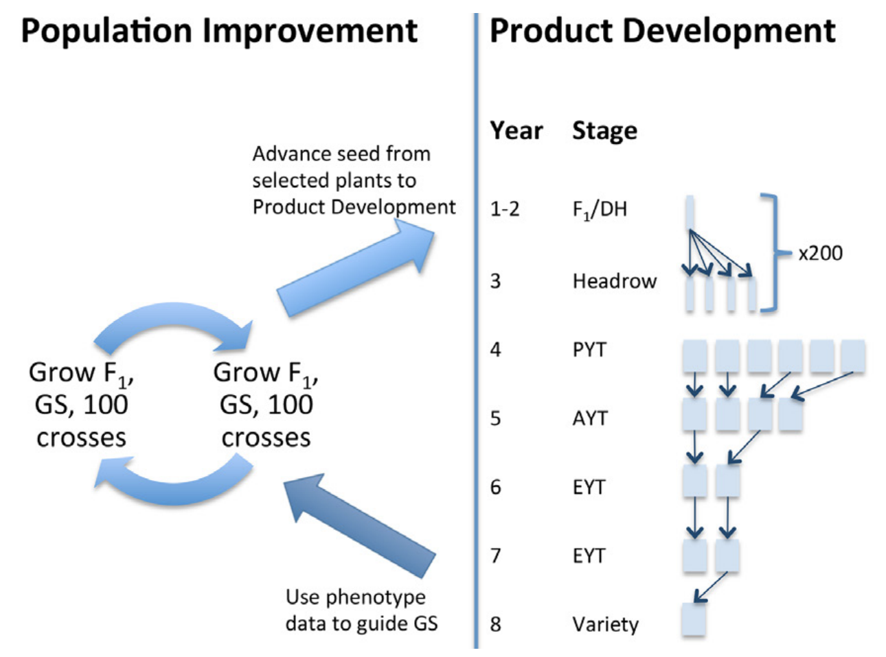

```{r setup, include=FALSE}
knitr::opts_chunk$set(
  echo = TRUE,
  collapse = TRUE,
  comment = "#>"
)
```

## Introduction
`AlphaSimHlpR` is an R package that is not on CRAN but can be installed from [github](www.github.com):
```{r Install AlphaSimHlpR, eval=FALSE}
if (!require("devtools")) install.packages("devtools")
devtools::install_github("jeanlucj/AlphaSimHlpR")
suppressMessages(library(AlphaSimHlpR))
```
The `suppressMessages` function is not strictly necessary, but removes a fair amount of output that doesn't seem necessary.  
The package is intended to simplify the simulation of a two-part breeding program, as defined by Gaynor et al. (2017)[^1]. The package assumes all individuals are outcrossed and clonally propagated.  

[^1]:Gaynor, R.C., G. Gorjanc, A.R. Bentley, E.S. Ober, P. Howell, et al. 2017. A Two-Part Strategy for Using Genomic Selection to Develop Inbred Lines. Crop Sci. doi: 10.2135/cropsci2016.09.0742.  

  

## Specifying simulation parameters
Three text control files are required to specify simulation parameters: a population control file, a scheme control file, and a costs control file. The control files need to be specified in that order:
```{r Specify simulation, eval=FALSE}
bsp <- specifyPopulation(ctrlFileName="PopulationCtrlFile.txt")
bsp <- specifyPipeline(bsp, ctrlFileName="ControlFile.txt")
bsp <- specifyCosts(bsp, ctrlFileName="CostsCtrlFile.txt")
```
All of the parameters in the control files are specified in the text file as follows:  

> \# The number of stages simulated and retained in the records  
> nStages  
> 3  

Any text after a \# symbol is ignored.  
`nStages` is a keyword to indicate how many stages the product development of your breeding scheme contains. The value to set that variable is given immediately on the next line (3 in this case).  
Control files for a toy example are provided with the package and can be found and used as follows:  
```{r Toy example, eval=FALSE}
pathToSimDirectory <- path.package("AlphaSimHlpR")
setwd(pathToSimDirectory)
bsp <- specifyPopulation(ctrlFileName="PopulationCtrlFile_Small.txt")
bsp <- specifyPipeline(bsp, ctrlFileName="ControlFile_Small.txt")
bsp <- specifyCosts(bsp, ctrlFileName="CostsCtrlFile_Small.txt")
```

## Parameters  
## Describing the crop species and founder population  
#### Chromosomes  
The species has a certain number of chromosomes:  

> nChr  
> 4  

Each chromosome is simulated to be 1 Morgan long in recombination map.  

#### Effective size of population generating the founders  
Aspects of polymorphism and linkage disequilibrium are determined by the population history of the founders:  

> effPopSize  
> 100  

The number of segregating sites per chromosome includes both QTL and observed SNPs. QTL and SNPs will be selected at random, so there is a chance that some QTL will be observed as SNPs:  

> segSites  
> 500

#### Genotyping resources  
`AlphaSimHlpR` assumes the breeder has some genotyping platform available to observe SNPs that track ancestry and segregation. The number of observed SNPs per chromosome:  

> nSNP  
> 200  

#### Genetic architecture and mode of gene action  
The number of QTL per chromosome:  

> nQTL  
> 50  

`AlphaSimHlpR` assumes no epistasis. Single genes have additive and dominance effects. The distribution of the degree of dominance is set by:   

> meanDD  
> 0.8  
> varDD  
> 0.01  

#### Genetic variance  
The genetic variance among founders is given in the population control file. The genetic variance will change as individuals are selected and move down the product development pipeline (see below). Those changes will depend on the genetic architecture as well as selection intensities. It is worth checking whether changes in genetic variance observed in the simulation match at all observations from historical data in the breeding program. The parameter to set founder genetic variance is:  

> genVar
> 40

#### Genotype by environment interaction variance  
AlphaSimHlpR deals with GxE in a very simple way. All GxE deviations are assumed to be IID. Each stage is characterized by a number of locations ($n_l$) and a number of reps within locations ($n_r$). Since an individual is evaluated in one stage for one year (then either removed or advanced to the next stage), the error variance for the mean of observations on an individual for a stage is:  
$$
errVar(\bar{y}_{stage}) = \sigma^2_{g \times y} + \frac{\sigma^2_{g \times l} + \sigma^2_{g \times y \times l} + \frac{\sigma^2_{plot(stage)}}{n_r}}{n_l}
$$
where $\sigma^2_{plot(stage)}$ is the plot error variance specified for that stage, and $\sigma^2_{g \times y}$, $\sigma^2_{g \times l}$, and $\sigma^2_{g \times y \times l}$ are the genotype by year, genotype by location, and genotype by year by location variances. These variances can be specified by:  

> gxyVar  
> 15  
> gxlVar  
> 10  
> gxyxlVar  
> 5  

Alternatively, a general genotype by environment variance can be given:  

> gxeVar  
> 30  

Any of `gxyVar`, `gxlVar`, or `gxyxlVar` that are not specified are set to a default. If `gxeVar` is given, the default is $\sigma^2_{g \times e} / 3$. If `gxeVar` is not given, the default is zero.  

## Product Development Pipeline  
The following parameters have to do with the product development part of the breeding program, that is, the right-hand side of the figure above.  

#### Number of stages in product pipeline  

> nStages  
> 4  

`AlphaSimHlpR` assumes that phenotypes collected during the stages are recorded and stored in a database. Even if evaluating the phenotype involves rapid visual assessment, there is a cost to recording the phenotypes. So evaluation in the product pipeline stages has a cost associated with it. All of the information collected in the product pipeline stages is used in analyses to estimate breeding values (BV) or total genotypic values (TGV). That means that if you use large numbers (e.g., 1000 or above), you have a lot of information but the simulation runs slowly. Many parameters are specified by stage (e.g., the stage names, `stageNames`) and the number of names given must match the number of stages specified here.  
AlphaSimHlpR also has an option for visually selecting F1s without incurring the phenotype recording cost (imagine selecting seedlings visually, and just transplanting the vigorous ones). That is discussed below.

#### Stage names  

> stageNames  
> CET PYT AYT UYT  

The stage names have no functional purpose but serve to help with plots and tables.

#### Number of entries in each stage  

> nEntries  
> 600 200 100 30  

Indicates how many individuals are entered into each stage.

#### Replications and locations  

>  nReps  
> 1 1 2 3  
> nLocs  
> 1 2 3 5  

Indicates how many replications are planted at each location and how many locations are used for evaluation in that stage. These numbers will affect the error variance assumed for phenotypic means from each stage.

#### Error variances  
Programs should estimate error variances from each stage using historical data. Each stage has a characteristic plot size and experimental design, so each stage's error variance will be different. The error variances are specified by:  

> errVars  
> 200 120 90 70  

#### Genotyping  

> stageToGenotype  
> F1  

Indicates the stage at which to genotype individuals. In addition to the named stages (CET, PYT, AYT, and UYT in this example), the user can specify "F1", which will cause all newly created progeny individuals to be genotyped. If `stageToGenotype` is not specified, the default will be to genotype all F1s.

#### Selection of entries to advance between stages 
A function must be given to calculate the selection criterion that is used to decide which individuals to advance from one stage to the next. Truncation selection is applied to that criterion. You can write your own function to do this (!) but `AlphaSimHlpR` provides two functions:

* `selCritIID`: Assumes no information sharing between individuals  
* `selCritGRM`: Calculates an additive GRM using markers and shares information between individuals according to it

In general, `selCritIID` seems appropriate to me for advancing individuals in the product pipeline. A nice feature might be enable information sharing in early stages when *per se* information is very noisy, and then transition to IID. That feature doesn't exist yet. So here's how to specify the function (if you write your own function, you have to give the name of that function):  

> selCritPipeAdv  
> selCritIID  

#### Selecting seeds to advance from the F1 to enter Stage 1 trials  
Possibly, the crossing nursery will generate more seeds than the number of individuals that will enter the first phenotyping stage (CET in the example above). There are three possibilities for choosing which F1s go to Stage 1, determined by among others these parameters:  

> phenoF1toStage1  
> TRUE  
> errVarPreStage1  
> 500  

* Random. This is the default. It occurs if `phenoF1toStage1` is omitted or is set to `FALSE`.  
* Based on visual phenotypic evaluation. For example, visual assessment of early seedling vigor and low disease.  In the control file, set phenoF1toStage1 to TRUE, and set errVarPreStage1 to some pretty high number (based on the assumption that the correlation between seedling visual appearance and genotypic value must be quite low).  
* Based on a genomic prediction.  For that to occur, the following conditions need to be true:  
  + The `stageToGenotype` needs to be set to `F1`.  
  + The `selCritPipeAdv` needs to be a function that can make a prediction based on genotype. In terms of functions provided by `AlphaSimHlpR`, that would be `selCritGRM`.  
  + `phenoF1toStage1` must be `FALSE`. Phenotypes take precedence over predictions at this stage.  

#### Checks  
Checks serve three purposes:  

1. They provide connectivity between trials. Trials in different years and locations may have different experimental entries. To estimate the main environment effect, use the checks.  
2. Checks can help characterize environments. For example, if a check is sensitive to drought, its performance may tell you about water availability in the environment.  
3. Checks can help estimate incomplete block effects. For this purpose, you need to decide how many experimental entry plots you will have for each check plot.  

Purpose 1 and 3 do not require so many checks. Purpose 2 requires more carefully chosen checks. `AlphaSimHlpR` only really applies Purpose 1.  

`AlphaSimHlpR` does not simulate field heterogeneity. The question of experimental design and heterogeneity of fields is independent of the question of breeding scheme optimization. If a new better experimental design is discovered that increases effective heritability by 0.05, that new heritability can be plugged in to the optimizer without explicitly simulating the field heterogeneity it effectively captures. Nevertheless, it is useful to retain checks in the simulation to account for their cost in different simulation schemes. In `AlphaSimHlpR` that is done with the `entryToChkRatio`:  

> entryToChkRatio  
> 17

In this example, we imagine incomplete blocks with 18 total plots, 17 experimental plots and one check. A single integer can be given here, in which case the ratio is constant across all stages, or each stage can have its own ratio:  

> entryToChkRatio  
> 35 17 11 11  

The number of unique individuals to use as checks is given by `nChks`:

> nChks  
> 2 5 5 5  

In this example, for cassava, there would be 2 unique clones used in the CET stage (each replicated a number of times over the field, given the large number of experimental plots), and 5 unique clones used in the PYT, AYT, and UYT stages. `AlphaSimHlpR` ensures that each check is used at least once in each replicate. Again, the main purpose of the checks in `AlphaSimHlpR` is to somewhat correctly assess field costs since field heterogeneity and specific environment heterogeneity are not simulated.  

## Population Improvement  
The following parameters have to do with the population improvement part of the breeding program, that is, the left-hand side of the figure above.  

#### Selection criterion for choosing parents  
As for the selection of entries to advance between stages, a selection criterion is calculated. The criterion is given as a function specified by `selCritPopImprov`:  

> selCritPopImprov  
> selCritGRM  

By default, `AlphaSimHlpR` provides the same functions here as for advancing within product development, that is `selCritIID` and `selCritGRM`. For population improvement, `selCritGRM` makes more sense, since it estimates breeding values with information sharing among clones. But it is substantially slower than `selCritIID`.  

#### Truncation selection or optimal contributions  
`AlphaSimHlpR` enables optimal contributions selection through the R package `optiSel`. The default, however, is truncation selection: a number of parents are selected, crosses are made between parents at random, each cross generates a fixed number of progeny:  

> nParents  
> 30  
> nCrosses  
> 80  
> nProgeny  
> 10  

If `nParents` is set to a low value, that translates to high selection intensity and conversely for a high value for `nParents`. Note that `AlphaSimHlpR` considers ALL individuals currently in the product development pipeline as selection candidates to become parents to create the next generation.  
To use optimal contributions, set

> useOptContrib  
> TRUE  
> targetEffPopSize  
> 20  
> nCandOptCont  
> 200  

Based on `targetEffPopSize`, the analysis calculates a maximum increase in the average coancestry from one generation to the next. This parameter determines the selection intensity: low `targetEffPopSize` means high selection intensity and conversely for high `targetEffPopSize`. Optimal contributions maximizes the selection criterion while constraining the coancestry increase. As a contrast, with truncation selection, two full-sibs might both be selected if they have good GEBVs. With optimal contributions, only the better of the two might be selected along with a candidate of lower GEBV that contributes diversity.  
Also if `useOptContrib` is `TRUE`, the specific crosses made between parents are chosen so the inbreeding coefficient of the F1 individuals is low. That is, pairs of parents are chosen to cross that have a low coefficient of coancestry. A simple greedy algorithm is used to choose the crosses, so it probably does not lead to a global minimum inbreeding coefficient.  
Finally, the optimal contributions algorithm is slow if applied to many many selection candidates. So selection candidates are prefiltered by truncation on the selection criterion leaving the best `nCandOptCont` individuals. Functionally, `nCandOptCont` is a guess at how low in the rankings optimal contributions might go. If `nCandOptCont` is small then optimal contributions might be prevented from finding individuals lower in the rankings that contribute unique diversity. If `nCandOptCont` is big, the analysis will be very slow without providing any extra benefit. As a guess, `nCandOptCont` = 10 * `targetEffPopSize` is OK.  

#### Using this year's phenotypes for model training
AlphaSimHlpR proceeds as follows:  

1. Simulate the phenotypic evaluations for the year  
2. Select parents and make crosses to create F1 seeds for the next year  

Logisitically, it is sometimes difficult to use phenotypes collected this year for model training to select parents. In cassava, for example, there is a very short time span between when plots are harvested and when they need to be replanted because the stakes will die. The variable `useCurrentPhenoTrain` determines whether the phenotypes from step 1 are available for step 2 in the same year. Generally in NextGen Cassava programs, phenotypes have not been immediately available. Thus, such programs should set:  

> useCurrentPhenoTrain  
> FALSE  

For a counter example, if a program planted a full set of clones in the crossing nursery immediately and then took it's time to chose which clones to cross based on this year’s phenotype, it would be correct to set `useCurrentPhenoTrain <- TRUE`.  

#### Number of cycles to keep records  
Phenotypes are used to estimate selection criteria with `selCritIID` or `selCritGRM`.
In principle, the more phenotypes you have the more accurate the criteria will be, up to a point (phenotypes of very distantly related individuals will not help, for example).  BUT, the more phenotypes, the slower the simulation. To balance cost / benefit, `nCyclesToKeepRecords` determines how many years of records to keep and use in estimating selection criteria.  Low values of `nCyclesToKeepRecords` will make simulations go faster, but possibly underestimate the gain that the breeding scheme can achieve. If you plan to run many many replicates of a particular breeding scheme, it may be worth evaluating the cost benefit explicitly and setting `nCyclesToKeepRecords` to a minimum value that nevertheless generates the same gain as a large value. Set this with:  

> nCyclesToKeepRecords  
> 4  

## Breeding scheme costs  
A cost control file contains parameters that determine how much the breeding scheme will cost:  

#### Cost per plot  
Plots in each stage have a characteristic cost as a function of their size:  

> plotCosts  
> 8 14 20 30  

#### Location cost  
As the breeding scheme uses more locations, it will cost more to maintain them:  

> perLocationCost  
> 3000  

#### Cost to create and develop an individual  

> crossingCost  
> 0.2  

#### Genotyping cost  
`AlphaSimHlpR` distinguishes a cost for QC genotyping (to verify pedigree and make sure there is no genotype mislabeling in plots) versus whole genome genotyping (for genomic prediction). At the moment, the QC genotyping cost is only incurred once.  

> qcGenoCost  
> 1.5  
> wholeGenomeCost  
> 10  

With these costs, the overall cost of the breeding scheme is calculated as:  

##### Development Costs  
`develCosts <- nCrosses * nProgeny * crossingCost`

##### Genotyping Costs  
The number of individuals genotyped depends on whether you specify a stage at which to genotype (the default is to genotype all F1s):  
`nGeno <- nCrosses * nProgeny`  
OR  
`nGeno <- nEntries[stageToGenotype]`  
Then  
`genotypingCosts <- nGeno * (qcGenoCost + wholeGenomeCost)`

##### Trial Costs  
Per year and for each trial stage, the number of plots are:  
`nPlots <- nEntries * nReps + nChks * chkReps`  
Note that the `chkReps` are determined by the number of plots used for entries and the `entryToChkRatio`  
`trialCosts <- nPlots * nLocs * plotCost`  
The overall cost of evaluation in the product pipeline is the sum of `trialCosts` across stages.  

##### Location Costs  
`locationCosts <- max(nLocs) * perLocationCost`  

All of these costs are summed to get the overall breeding scheme cost.

## `AlphaSimHlpR` outputs  
One simulation or multiple replicated simulations can be run by:  
```{r One or more simulations, eval=FALSE}
simOut <- runBreedingScheme(nCycles=bsp$nCyclesToRun, initializeFunc=initFuncADChk, productPipeline=prodPipeFncChk, populationImprovement=popImprov1Cyc, bsp=bsp)

repSimOut <- lapply(1:nReplications, runBreedingScheme, nCycles=bsp$nCyclesToRun, initializeFunc=initFuncADChk, productPipeline=prodPipeFncChk, populationImprovement=popImprov1Cyc, bsp)
```
Then, the object `simOut` will be a list containing three objects:  

1. `records` This object itself is a list. It contains an object `F1` that is an `AlphaSimR` population. It contains a list for each of the product development stages. The objects in those lists are tibbles with phenotypic records for each year. The maximum length of those lists is `nCyclesToKeepRecords`. Finally, it contains a tibble called `stageOutputs` that has summary values for each cycle and each stage simulated (see below).  
2. `bsp` This object is a list with all the parameters entered above and also derived costs.  
3. `SP`  The `AlphaSimR` simulation parameters.  

Of course, `repSimOut` will be a list that is `nReplications` long of objects like `simOut`.

The tibble `records$stageOutputs` has for each stage within each cycle:  

* `genValMean` Mean true genotypic value of clones in the stage.  
* `genValSD` Standard deviation of these genotypic values.  
* `evalAtSelMean`	Mean estimated value (i.e., the selection criterion used for product advancement) of clones in the stage. Not so useful because zero centered.  
* `evalAtSelSD` Standard deviation of these estimated values.  
* `accAtSel` Correlation between (true genotypic value, estimated value).  
* `gvOfBestCrit` True genotypic value of the clone with the highest estimated value.  
* `highestGV`	True genotypic value of the clone with the highest genotypic value.  
* `nContribToPar` This is a tibble with two columns: `cycle` is relative to the current cycle, which should have an integer number equal to the `nCyclesToKeepRecords` and previous cycles have lower numbers (down to 1). `nContribToPar` is how many individuals from this stage and in the cycle were selected to be parents to create the next cycle.

Simple plots of gain from selection can be made if you have replicated simulations:  
```{r Plot replicated simulations, eval=FALSE}
plotData <- plotRecords(repSimOut)
```
The plots will show the change of the population mean over time and of the genotypic value of the individual that had the highest estimated value (not necessarily the indvidual with the true highest genotypic value, since the estimated value will have error).